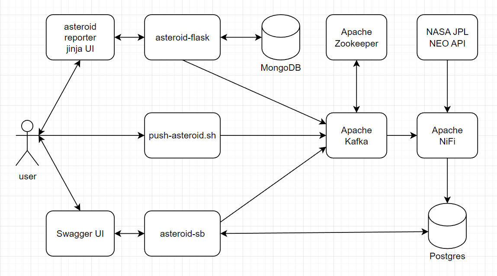
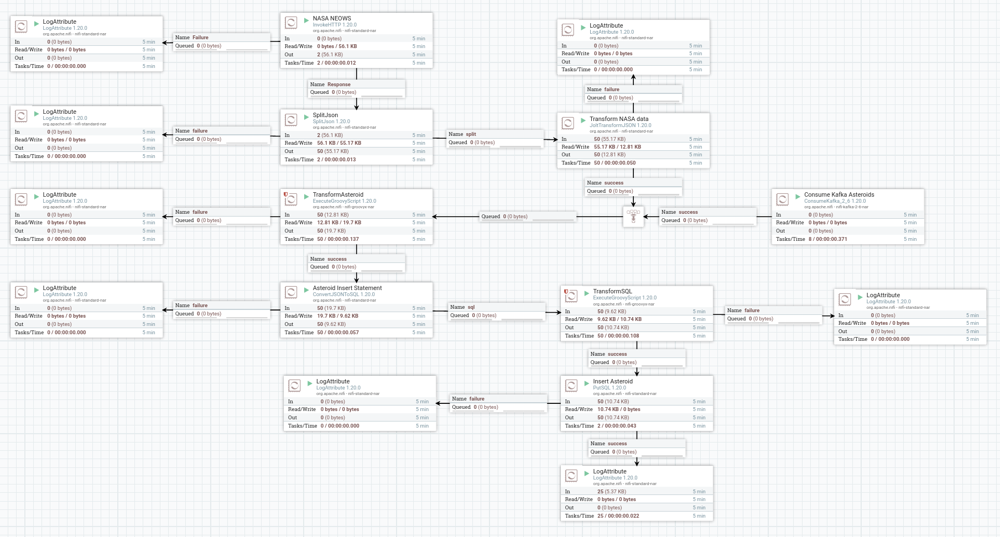
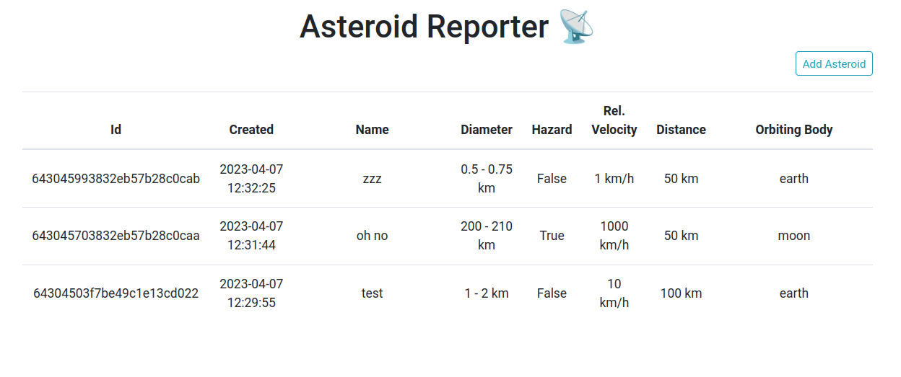
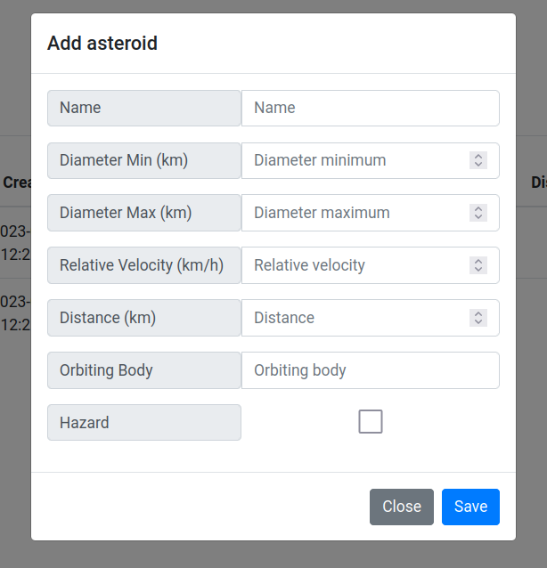

# asteroid-nifi

A NiFi flow to ingest and transform asteroid data.

This little project is just to get more practice with data flows using Apache NiFi and Apache Kafka.
I'm using a combination of mock data pulled from [NASA's NeoWs API](https://api.nasa.gov/) and generated random data.

## NiFi

Multiple data inputs:

1. Kafka - SpringBoot, Flask, and shell script generated asteroids
2. HTTP - NASA NeoWs API

Each input is converted to JSON, cleaned/transformed a bit, and inserted into Postgres.

## Flask App

Simple flask api with Jinja UI. User can submit and view asteroid data.

## Not Implemented

Things I didn't end up doing because I was lazy and wanted to keep the project moving.

- `asteroid-flask`
  - App/Api only allows creating and viewing asteroids
  - Fetch all endpoint is not paged
  - Button to generate a random asteroid
  - Pull straight from MongoDB to NiFi
- `asteroid-sb`
  - Fetch all endpoint is not paged
  - Thymeleaf asteroid summary page
- `nifi`
  - Use NASA NEOWS API; I stuck with my mock API using their sample data
  - Sending a discord alert if an asteroid is a hazard

## URLs

- Flask Asteroid Reporter - http://localhost:9000
- SpringBoot Asteroid API - http://localhost:9001
- SpringBoot Asteroid API Swagger - http://localhost:9001/swagger-ui.html
- NiFi - http://localhost:8250/nifi/

## Dev

- Spin up everything - `docker compose up -d`
- Spin down everything - `docker compose down` (add `--volumes` to also wipe out volumes)
- Fully rebuild SpringBoot API - `docker compose up -d --force-recreate --build asteroid-sb`
- Send a random asteroid - `./scripts/push-asteroid.sh`
- Send 10 random asteroids - `./scripts/push-asteroid-many.sh`

## References

- NASA JPL NEO - https://cneos.jpl.nasa.gov/
- NASA API: Asteroids - NeoWs - https://api.nasa.gov/
- JSONPath Online Evaluator - https://jsonpath.com/
- Jolt Transform Demo - https://jolt-demo.appspot.com
- [Steven Koon YouTube Channel](https://www.youtube.com/@StevenKoon)
- [Apache NiFi Crash Course](https://www.youtube.com/watch?v=fblkgr1PJ0o)
